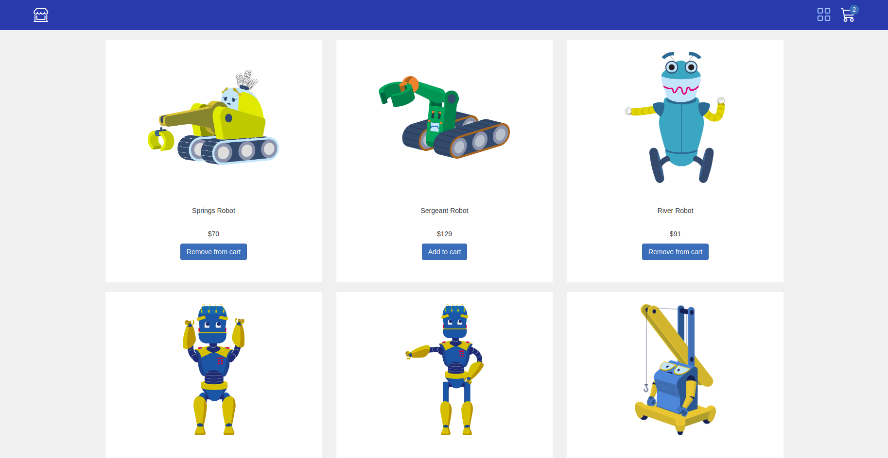

<h1 align="center">Robot Shop</h1>

Website implemented using React.js and Redux Toolkit
 

  

On the website, users can easily add or remove items from their shopping cart and conveniently track the number of items they've added. Additionally, you can explore the contents of your cart to review your selections.

Throughout the development of this website, practised skills in creating a Redux store, and worked with reducers, actions, and slices. Also, retrieved data from the Redux store, which includes data fetching via API requests. The website was developed with the LinkedIn Learning course.

### Built With
* [React](https://react.dev/)
* [Redux toolkit](https://redux-toolkit.js.org/)

